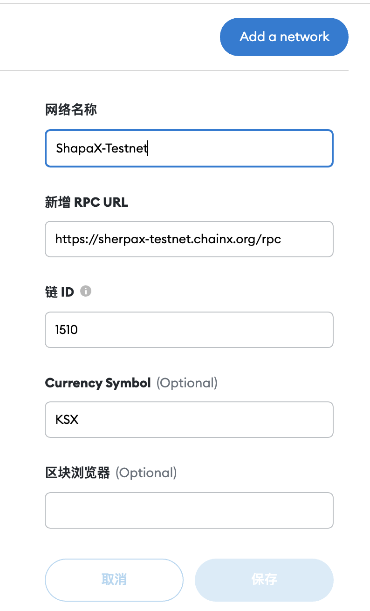

# How to deploy a contract on the Sherpax testnet
- React deploys contracts from 0 to 1 to develop dapps: https://dev.to/dabit3/the-complete-guide-to-full-stack-ethereum-development-3j13
- web3 Summary of learning resources: https://www.useweb3.xyz/

## 1.connect metamask(chainid=1506)
First link Sherpax Testnet using metamask
```txt
network name: ShapaX-Testnet
RPC URL:https://sherpax-testnet.chainx.org/rpc
chain ID:1506
Currency Symbol:KSX
```


## 2.transfer assets
Deposit from substrate to Ethereum


## 3.deploy contract
Here is an example of the WKSX contract, the source code address：https://github.com/chainx-org/SherpaX/blob/evm_contracts/contracts/wksx_istanbul.sol
Select compiler version：istanbul

After the compilation is successful, select injected web3 and click Deploy

The address after successful deployment：0xc01Ee7f10EA4aF4673cFff62710E1D7792aBa8f3
