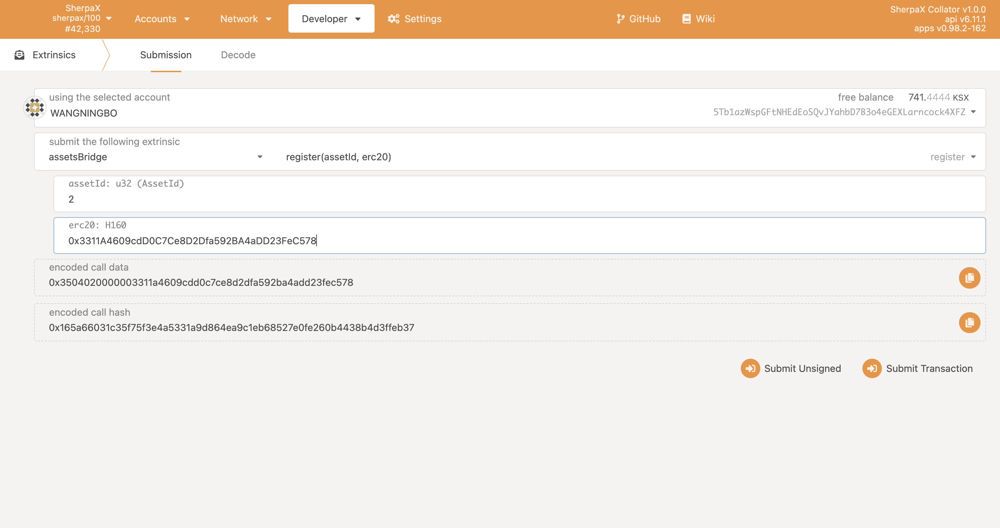
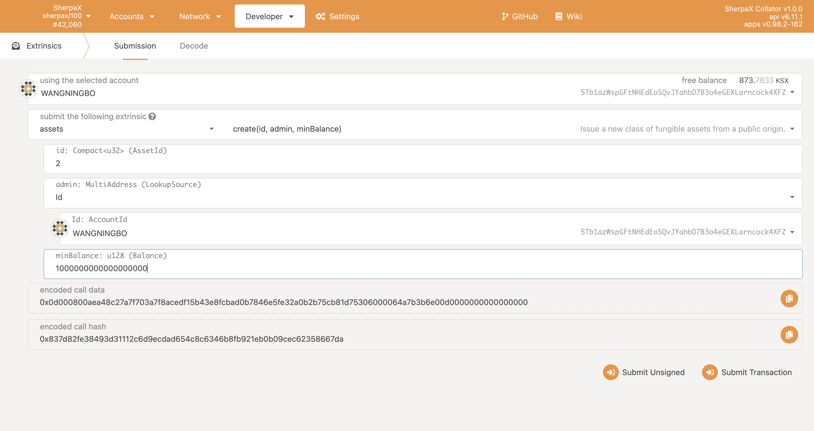
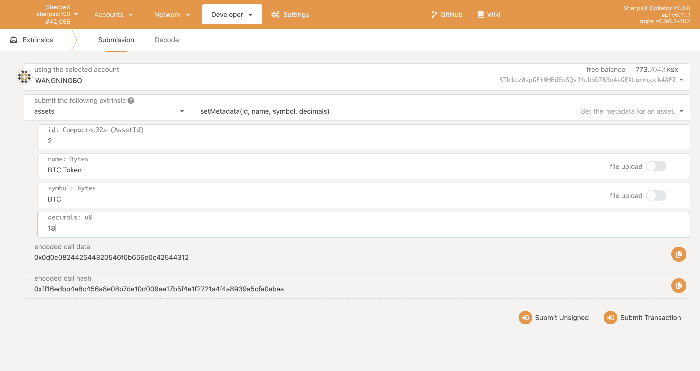
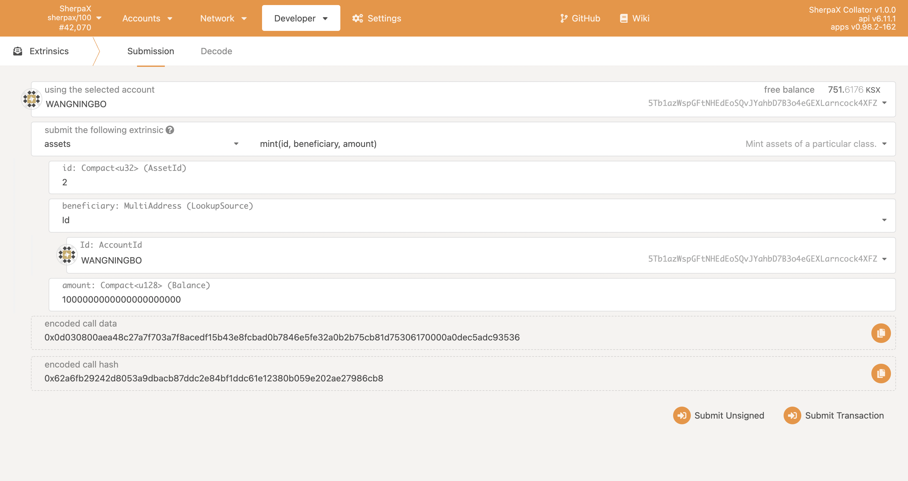
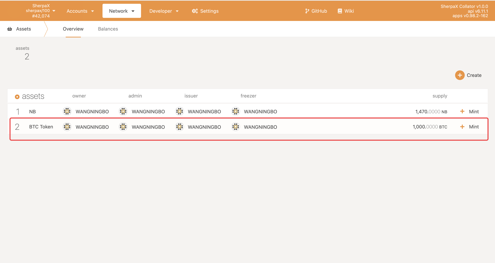
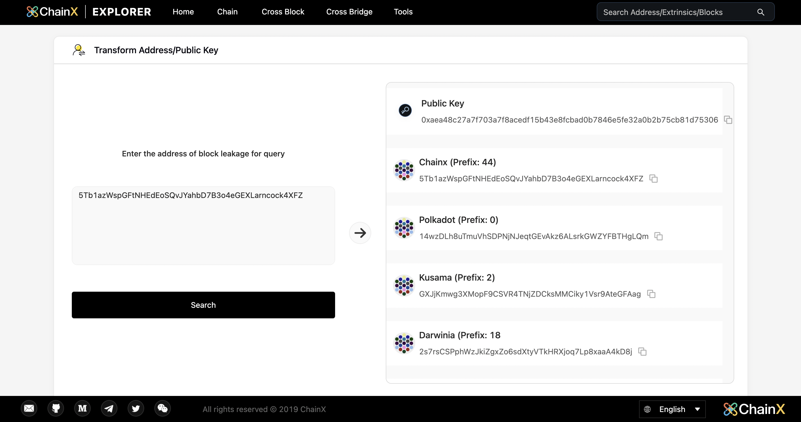
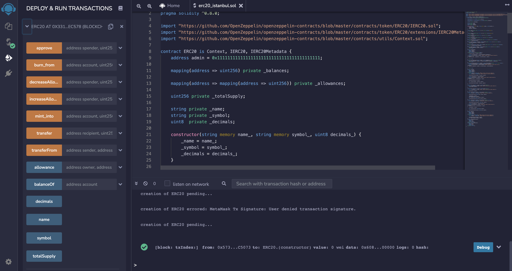
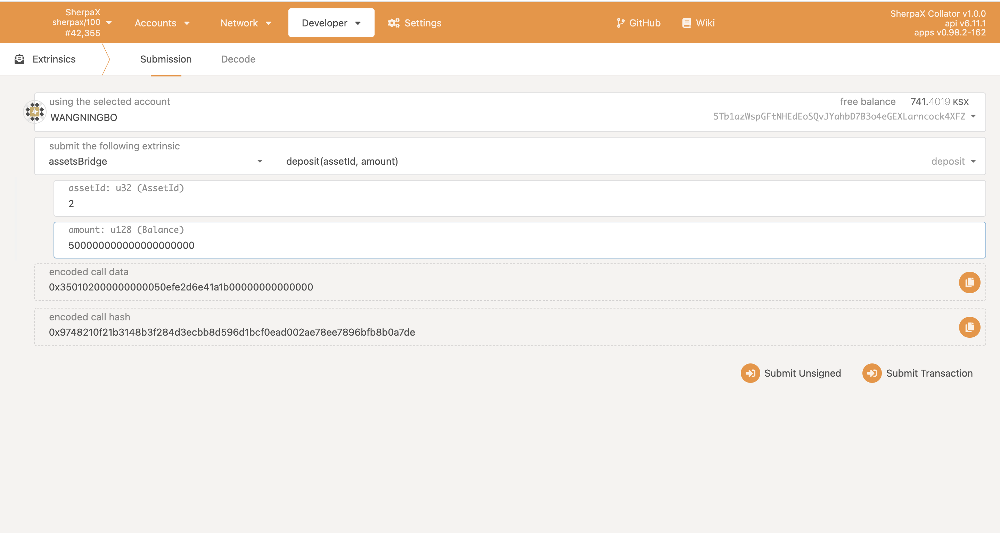
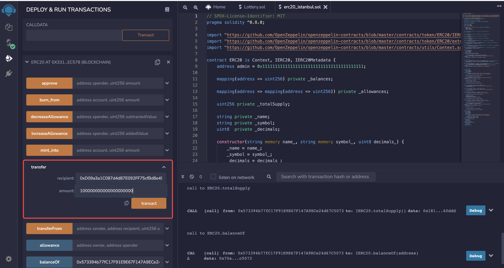
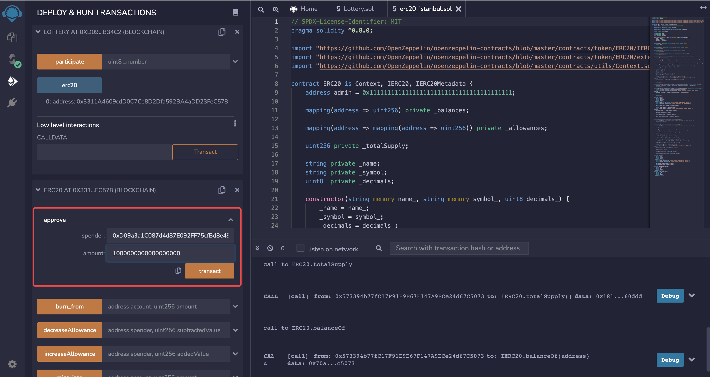

# Play around with the Sherpax asset module
## AssetId Bridge administrator
### register
Only administrators can call successfully
AssetId=2,erc20：0x3311A4609cdD0C7Ce8D2Dfa592BA4aDD23FeC578


## general user
### 1.Use pallet-assets to create assets, creating assets will lock 100KSX
Set AssetId to 2, AssetId Admin, minBalance, the account will be destroyed if the balance is smaller than this

After the creation is successful, metadata (name, symbol, decimal) can be set

AssetId Admin sets the amount you want to mint

In the assets module, you can view the assets just created


### 2.Bind evm address and substrate account
We borrow the chainx browser tool to generate the public key：https://scan.chainx.org/#/tools/ss58

Sign with the evm account private key (evm:substrate account public key), generate eth_signature, borrow remix here, and link your own account in metamask
Click where the arrow is pointing

fill inevm:aea48c27a7f703a7f8acedf15b43e8fcbad0b7846e5fe32a0b2b75cb81d75306，such a format

	Click ok to generate eth_signature

Use the substrate account to call claim_account to complete the binding, and paste the signature information below to complete the binding

After the binding is completed, you can call the teleport in the asset bridge to complete the transfer of KSX from the substrate account to the bound evm account (at this time, the evm account has currency and can pay gas fees). Here we transfer 10 KSX, note that intoEvm selects yes


### 3.Deploy the corresponding ERC20 contract
First link Sherpax Testnet using metamask
```txt
network name: ShapaX-Testnet
RPC URL:https://sherpax-testnet.chainx.org/rpc
chain ID:1506
Currency Symbol:KSX
```
Then we can deploy the corresponding erc20 contract on the EVM: name=WBTC Token, symbol=WBTC, decimals=18
erc20 contract example：https://github.com/chainx-org/SherpaX/blob/testnet/contracts/erc20_istanbul.sol
Note that the compiler has to choose：istanbul

Deployment success address：0x3311A4609cdD0C7Ce8D2Dfa592BA4aDD23FeC578

### 4.AssetId Bridge administrator calls register to bind assetId and erc20 contract address
### 5.deposit
Complete the deposit of pallet-assets to erc20, from 500BTC to 500WBTC

We can query 500WBTC by querying the balance on the remix side
At this time, the assets deposited from the substrate account meet the ERC20 standard. Let's use a guessing game to see the specific use of WBTC

```solidity
//SPDX-License-Identifier: MIT
import "https://github.com/OpenZeppelin/openzeppelin-contracts/blob/master/contracts/token/ERC20/IERC20.sol";
pragma solidity ^0.8.0;
contract Guessing {
    IERC20 public erc20;
    constructor(address _erc20){
        erc20=IERC20(_erc20);
    }
    function participate(uint8 _number) public {
        require(_number==0 || _number==1);
        erc20.transferFrom(msg.sender,address(this), 1000000000000000000);
        if(_number==getNumber()){
            getWBTC(msg.sender,2000000000000000000);
        }
    }
    function getNumber() private view returns(uint){
        uint number = uint(keccak256(abi.encodePacked(block.timestamp, msg.sender,block.number))) % 2;
        return number;
    }
    function getWBTC(address _address,uint amount) private{
        erc20.transfer(_address,amount);
    }
}
```
Deployment address：0xD09a3a1C087d4d87E092FF75cfBd8e49f32b34c2
Call the previous transfer to this game contract and pre-fund 100WBTC

Now you can start playing

Any user with a minimum asset of 1WBTC must authorize each time before calling participate

Click on participate to participate, enter guess big and guess small, 0 is small and 1 is big.Guess wrong and you will lose 1WBTC, guess right and you will win 1WBTC


### 6.withdraw
When you want to transfer assets from evm to substrate, you can call withdraw in assets-bridge to get the assets back to substrate

