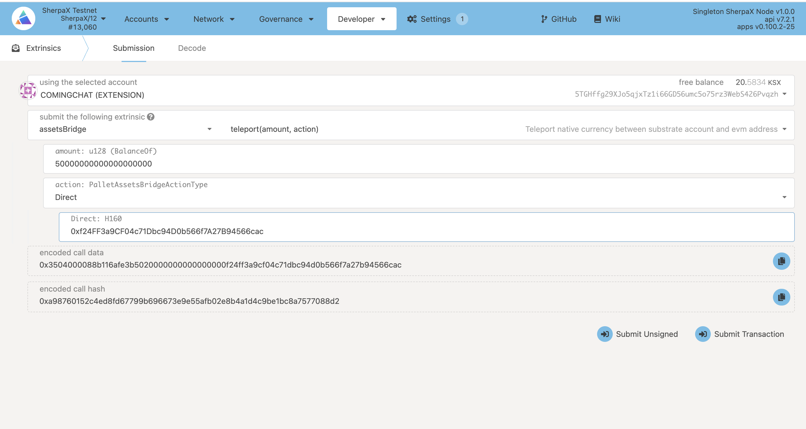

# 如何在sherpax测试网上部署合约
## 1.链接metamask
首先使用metamask链接Sherpax Testnet
```txt
网络名称: ShapaX-Testnet
RPC URL:https://sherpax-testnet.chainx.org/rpc
链ID:1510
Currency Symbol:KSX
```


## 2.转移资产
从substrate充值到以太坊


## 3.部署合约
这里以WKSX合约为例，源码地址：https://github.com/chainx-org/SherpaX/blob/evm_contracts/contracts/wksx_istanbul.sol
选择编译器版本：istanbul

编译成功之后，选择injected web3，点击部署

部署成功后的地址：0xc01Ee7f10EA4aF4673cFff62710E1D7792aBa8f3
