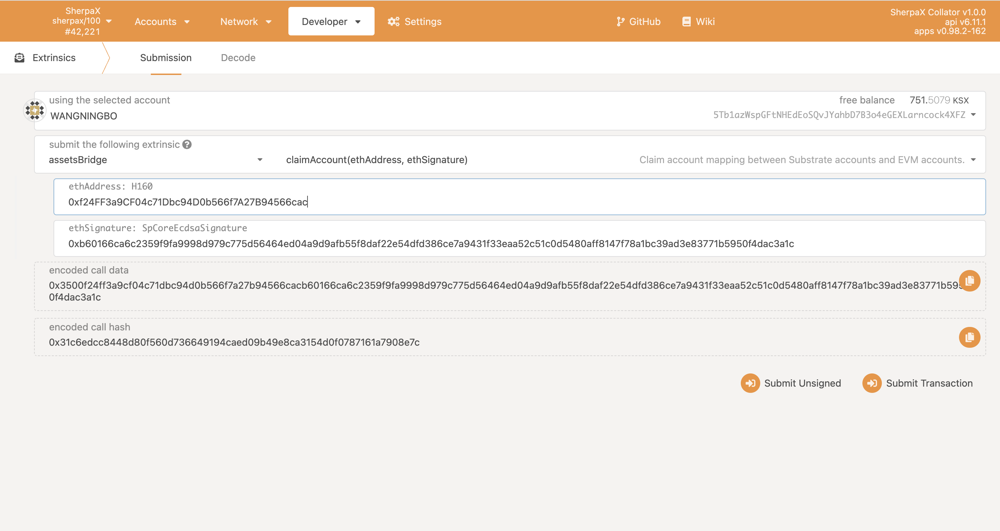

# 玩转Sherpax跨链资产转移
## AssetId Bridge管理员
### register
只能有管理员才能调用成功
AssetId=2,erc20地址：0x3311A4609cdD0C7Ce8D2Dfa592BA4aDD23FeC578

## 普通用户
### 1.使用pallet-assets创建资产,创建资产会锁定100KSX
设置AssetId为2，AssetId Admin，minBalance，账户小于此余额将会被销毁

创建成功之后可以设置metadata(name,symbol,decimal)

AssetId Admin设置想要mint的金额

在资产模块里面可以查看刚刚创建的资产

### 2.绑定evm地址和substrate账户
我们借用chainx浏览器工具生成公钥：https://scan.chainx.org/#/tools/ss58

用evm账户私钥签名(evm:substrate账户公钥),生成eth_signature，这里借用remix，要链接metamask中自己的账户
点击箭头所指的位置

填入evm:aea48c27a7f703a7f8acedf15b43e8fcbad0b7846e5fe32a0b2b75cb81d75306，这样的格式

​	点击ok即可生成eth_signature

用该substrate账户调用claim_account完成绑定，将签名信息粘贴到下面，即可完成绑定

绑定完成之后，可以调用资产桥中的teleport完成从substrate账户到绑定的evm账户的传送KSX(此时evm账户拥有currency, 可以支付gas费)，这里我们传送10个KSX，注意intoEvm选择yes

### 3.部署对应的ERC20合约
首先使用metamask链接Sherpax Testnet
```txt
网络名称: ShapaX-Testnet
RPC URL:https://sherpax-testnet.chainx.org/rpc
链ID:1505
Currency Symbol:KSX
```
之后我们就可以在EVM部署相对应的erc20合约: name=WBTC Token, symbol=WBTC, decimals=18
erc20合约实例：https://github.com/chainx-org/SherpaX/blob/testnet/contracts/erc20_istanbul.sol
注意编译器要选择：istanbul

部署成功地址：0x3311A4609cdD0C7Ce8D2Dfa592BA4aDD23FeC578
### 4.由AssetId Bridge管理员调用register将assetId和erc20合约地址绑定
### 5.deposit
完成pallet-assets到erc20的充值，从500BTC到500WBTC

我们在remix这边使用查询余额就能查询到500WBTC
此时由substrate账户deposit过来的资产就符合ERC20标准，下面用一个猜大小游戏来看看WBTC的具体使用
```solidity
//SPDX-License-Identifier: MIT
import "https://github.com/OpenZeppelin/openzeppelin-contracts/blob/master/contracts/token/ERC20/IERC20.sol";
pragma solidity ^0.8.0;
contract Guessing {
    IERC20 public erc20;
    constructor(address _erc20){
        erc20=IERC20(_erc20);
    }
    function participate(uint8 _number) public {
        require(_number==0 || _number==1);
        erc20.transferFrom(msg.sender,address(this), 1000000000000000000);
        if(_number==getNumber()){
            getWBTC(msg.sender,2000000000000000000);
        }
    }
    function getNumber() private view returns(uint){
        uint number = uint(keccak256(abi.encodePacked(block.timestamp, msg.sender,block.number))) % 2;
        return number;
    }
    function getWBTC(address _address,uint amount) private{
        erc20.transfer(_address,amount);
    }
}
```
部署地址：0xD09a3a1C087d4d87E092FF75cfBd8e49f32b34c2
调用之前的transfer给这个游戏合约，预先注资100WBTC

接下来就可以开始玩游戏了
随便一个用户，最低拥有1WBTC的资产，每次调用participate之前，要进行授权

点击participate参与，输入猜大猜小，0为小1为大，

猜错会失去1WBTC，猜对会赢得1WBTC
### 6.withdraw
当你想要从evm资产转移到substrate时，可以调用assets-bridge中的withdraw，把资产拿回substrate

